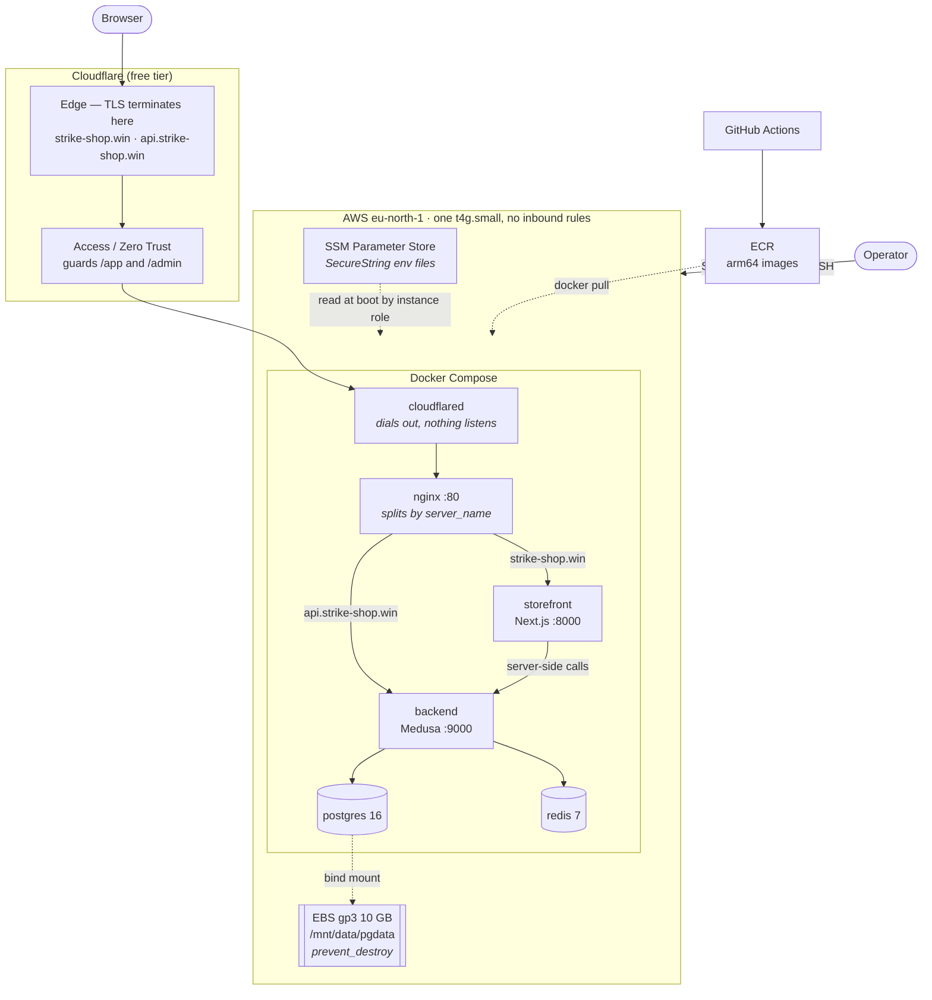

# strike-shop

Monorepo for the shop: a Medusa backend (`apps/backend`) and a Next.js
storefront (`apps/storefront`). Package manager is npm, scripts run through
turbo.

## Running locally

Requires Node.js 20+, PostgreSQL 15+, and Redis (optional — without
`REDIS_URL` Medusa falls back to in-memory implementations).

1. Install dependencies:

```bash
npm install
```

2. Create the backend env file and fill in `DATABASE_URL`:

```bash
cp apps/backend/.env.template apps/backend/.env
```

3. Run migrations (from `apps/backend`):

```bash
npx medusa db:migrate
```

4. Create an admin user (from `apps/backend`):

```bash
npx medusa user -e admin@test.com -p supersecret
```

5. Start both apps:

```bash
npm run dev
```

Backend at `http://localhost:9000` (admin at `/app`), storefront at
`http://localhost:8000`.

Grab the publishable key from the admin: Settings → Publishable API key. Put
it in `apps/storefront/.env.local`.

## Storefront environment variables

| Variable | Description | Default |
|---|---|---|
| `NEXT_PUBLIC_MEDUSA_PUBLISHABLE_KEY` | Publishable API key from the backend | — |
| `NEXT_PUBLIC_MEDUSA_BACKEND_URL` | Public backend URL, baked into the bundle at build time | `http://localhost:9000` |
| `MEDUSA_BACKEND_URL` | Private backend URL for server-side calls | value of `NEXT_PUBLIC_MEDUSA_BACKEND_URL` |
| `NEXT_PUBLIC_DEFAULT_REGION` | Default region country code | `ua` |
| `NEXT_PUBLIC_BASE_URL` | Storefront base URL | `https://localhost:8000` |

## Deployment

Live at **[strike-shop.win](https://strike-shop.win)**, admin at
[api.strike-shop.win/app](https://api.strike-shop.win/app).

It runs on a single AWS Graviton instance (`t4g.small`, arm64) provisioned by
Terraform — see [infra/README.md](infra/README.md) — with the whole stack in
Docker Compose behind a Cloudflare Tunnel. Nothing is exposed to the internet
directly: the security group has no inbound rules at all, and shell access
goes through AWS Session Manager rather than SSH.

Images are built for `linux/arm64` by GitHub Actions and pushed to ECR.
Server setup, secrets and the rollout procedure are in
[deploy/README.md](deploy/README.md).

## Architecture



The shape of it: **nothing in AWS accepts an inbound connection.** The security
group has zero ingress rules, there is no key pair and no open port 22.
`cloudflared` opens an outbound tunnel to the Cloudflare edge, and the operator
gets a shell through Session Manager over the same outbound path. TLS
terminates at the edge, which is why nginx below it only ever speaks plain
HTTP.

The one piece of state that must outlive the instance is Postgres, so it lives
on a separate EBS volume with `prevent_destroy`. That is not caution for its
own sake: the storefront's publishable key is baked into the Next.js bundle at
build time and is re-generated by the seed on every fresh database, so losing
the volume means every `/store/*` call returns 400 until the storefront is
rebuilt. Instance replacement was tested end to end on 2026-08-13 — the
replacement found the volume, did **not** reformat it, and the data survived.

## What it costs

Measured from Cost Explorer and the Price List API on 2026-08-14, region
`eu-north-1`:

| Item | Rate | $/month |
|---|---|---|
| EC2 `t4g.small`, 24/7 | free trial, 750 h/month | **0.00** |
| EBS gp3, 30 GB root | $0.0836/GB-mo | 2.51 |
| EBS gp3, 10 GB Postgres data | $0.0836/GB-mo | 0.84 |
| Public IPv4 address | $0.005/h | 3.65 |
| S3 state bucket, Parameter Store, KMS, CloudWatch, ECR | within always-free tiers | ~0.00 |
| **Total** | | **6.99** |

Compute is the largest line item and it currently bills at zero: the t4g free
trial covers 750 hours a month of `t4g.small`, and a month is 730 hours. Verify
against the meter rather than the price list — in Cost Explorer the
`EUN1-BoxUsage:t4g.small` line shows real hours at $0.00. When the trial ends
the instance starts costing $0.0172/h and this table becomes **$19.55/month**,
so the number to design against is that one, not $6.99.

Note what this makes the public IPv4 address: at $3.65/month it is the single
most expensive thing here, more than both EBS volumes together. It exists only
because the instance sits in a public subnet and needs outbound access.

Zero-cost by choice, not by luck: Cloudflare Tunnel and Access (free tier) and
GitHub Actions on a public repository. There is no load balancer, no NAT
gateway and no managed database — see below. ECR's private-repo free tier
(500 MB-month, 12 months from account creation) covers the two images today;
the lifecycle policy caps growth at 10 tagged versions each, so this is worth
re-checking once the free tier runs out.

Actually billed so far: **$0.00.** The account carries a $200 Free Tier credit
balance, and usage is drawn against it — $0.20 consumed at the time of writing.
At $0.23/day the credits outlast the project by a wide margin.

## Design decisions

**Why no NAT gateway.** The instance sits in a *public* subnet, deliberately.
Outbound traffic from a private subnet needs a NAT gateway at ~$33/month —
nearly twice the entire running cost of this stack, to protect an instance that
already accepts no inbound connections. The security posture comes from the
empty security group and the outbound-only tunnel, not from subnet topology. A
private subnet here would be a $33/month diagram decoration.

**Why Postgres on the instance, not RDS.** `db.t4g.micro` on RDS is ~$12/month —
roughly double what the rest of the infrastructure costs — for a database
holding a seeded demo catalogue. Three conditions make running it in Docker
Compose defensible here: the data is reproducible from a seed script, the
blast radius of losing it is one command, and the cost is real money against a
fixed credit budget. In a real production system the choice inverts, and it is
worth naming what is being given up: automated snapshots and point-in-time
recovery (here, that would be a cron `pg_dump` — a backup, not a recovery
*plan*, until someone has restored from it once), surviving the loss of the
instance without the EBS volume, and minor-version patching as a checkbox
instead of a maintenance window someone has to plan.

**Why no staging environment.** A second always-on environment doubles the only
bill that runs continuously and buys nothing this project needs.

## Payments

The Monobank integration is documented separately:
[apps/backend/src/lib/monobank/README.md](apps/backend/src/lib/monobank/README.md).
